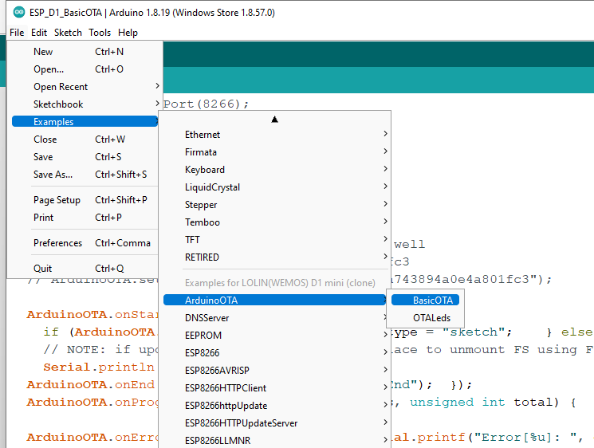

# ESP_D1_OTA

1. Step 1: Connect the ESP unit with your computer.
2. Step 2: Select appropriate board and port
3. Step 3: File >> Examples >> ArduinoOTA >> BasicOTA 
4. Step 4: Edit wifi credential and upload it
5. Step 5: TO confirm that the device is working properly, open terminal with proper baud rate and see the IP address is there.
6. Step 6: Also see the both ports physical and wifi port.
7. Step 7: Disconnect it from the computer and conncet it to a different power supply. Now see that the physical port is no more in the list. You can find only the network port in other words OTA port.
8. Step 8: File >> Examples >> ArduinoOTA >> OTALeds and edit your function in the loop. OR go step 9.
9. Step 9: Upload the second program given here (ESP_D1_OTA_01.ino). See that the led is blinking.
10. Step 10: Now change the delay time in the loop and see the effect. 
11. Step 11: [Check out my video here](https://youtube.com/shorts/qipZzylAE3A?feature=share) 
